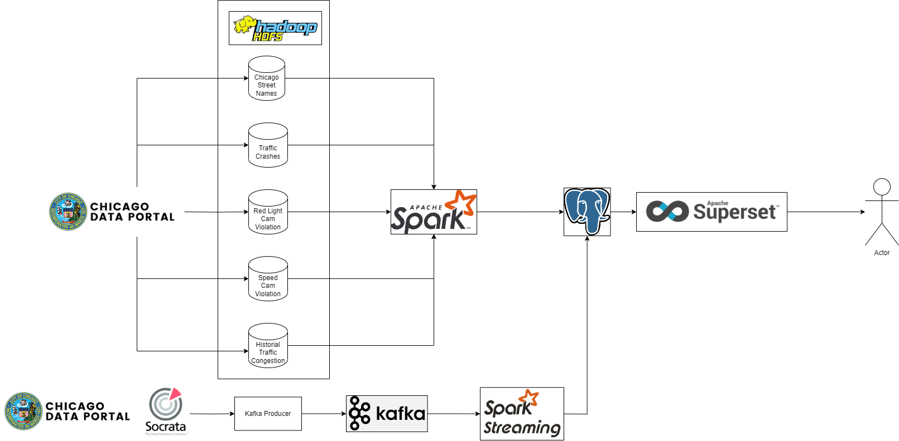

# Xử lý dữ liệu theo lô và streaming và trực quan hóa trên PostgreSQL
Bài tập lớn môn INT3229E - Kỹ thuật và công nghệ dữ liệu lớn

Hình 1. Tổng quan kiến trúc

Bài tập lớn sử dụng các tập dữ liệu được công bố tại cổng dữ liệu thành phố Chicago:
| Tên tập dữ liệu                                           	| Dữ liệu lô hay streaming? 	| Mô tả                                                                                                                                                                                 	| Đường link                                                                                                 	|
|-----------------------------------------------------------	|---------------------------	|---------------------------------------------------------------------------------------------------------------------------------------------------------------------------------------	|------------------------------------------------------------------------------------------------------------	|
| Traffic Crashes - Crashes                                 	| Lô                        	| Khai báo tai nạn giao thông trong thành phố Chicago bởi Sở Cảnh sát Chicago từ năm 2015 tới nay                                                                                       	| https://data.cityofchicago.org/Transportation/Traffic-Crashes-Crashes/85ca-t3if                            	|
| Red Light Camera Violations                               	| Lô                        	| Tổng kết số lượng vi phạm đèn đỏ theo ngày với mỗi camera phạt nguội đèn đỏ của thành phố Chicago, từ 1/7/2014 tới nay                                                                	| https://data.cityofchicago.org/Transportation/Red-Light-Camera-Violations/spqx-js37                        	|
| Speed Camera Violations                                   	| Lô                        	| Tổng kết số lượng vi phạm vượt quá tốc độ tối đa theo ngày với mỗi camera phạt nguội tốc độ của TP Chicago, từ 1/7/2014 tới nay                                                       	| https://data.cityofchicago.org/Transportation/Speed-Camera-Violations/hhkd-xvj4                            	|
| Historical Congestion Estimates by Segment - 2018-current 	| Lô                        	| Ước tính lượng xe lưu thông trên mỗi đoạn đường trên toàn thành phố, 2018-nay                                                                                                         	| https://data.cityofchicago.org/Transportation/Chicago-Traffic-Tracker-Historical-Congestion-Esti/sxs8-h27x 	|
| Current Traffic Congestion Estimates                      	| Streaming                 	| Ước tính lượng xe lưu thông trên mỗi đoạn đường trên toàn thành phố, dữ liệu gần thời gian thực (mỗi bản ghi phản ánh 10 phút giao thông trước đó, dữ liệu được cập nhật mỗi 15 phút) 	| https://data.cityofchicago.org/Transportation/Chicago-Traffic-Tracker-Congestion-Estimates-by-Se/n4j6-wkkf 	|
| Chicago Street Names                                      	| Lô                        	| Tất cả tuyến phố của thành phố Chicago: tên đầy đủ, hướng, tên phố, hậu tố, hướng hậu tố, số nhà lớn/nhỏ nhất                                                                        	| https://data.cityofchicago.org/Transportation/Chicago-Street-Names/i6bp-fvbx                               	|

Các tập dữ liệu trên được xử lý và biến đổi thành dạng star schema 
và lưu trữ trên Data Mart PostgreSQL, 
sau đó dữ liệu được trực quan hóa bằng Apache Superset.
Với dữ liệu dạng lô, tập dữ liệu sẽ được tải từ nguồn vào HDFS, 
sau đó sử dụng Spark DataFrame API để biến đổi dữ liệu đó 
từ dạng trải phẳng thành dạng star schema OLAP.
Với dữ liệu dạng streaming, Spark Streaming sẽ nhận dữ liệu từ Kafka 
và chia luồng dữ liệu thành nhiều micro-batch, 
biến đổi từng micro-batch để thành các bản ghi phù hợp để thêm vào Data Mart.

Cấu trúc của repository mã nguồn này như sau:
| Đường dẫn thư mục/tệp mã nguồn | Mô tả                                                                                                                                                  |
|--------------------------------|--------------------------------------------------------------------------------------------------------------------------------------------------------|
| /batch                         | Các job biến đổi dữ liệu dạng lô. Readme tại [đây](batch/README.md)                                                                                    |
| /streams                       | Kafka Producer bao quanh API Socrata của tập dữ liệu lô, Job Spark Streaming đọc từ Kafka và transform dữ liệu. Readme tại [đây](streams/README.md)    |
| /sql                           | Các câu lệnh DDL, DML dùng trên Spark SQL API hoặc PostgreSQL. Readme tại [đây](streams/README.md)                                                     |
| .env, .env.template            | File biến môi trường chứa thông tin triển khai Kafka và PostgreSQL. Dùng khi chạy các job Spark và khi triển khai các dependencies bằng Docker Compose |
| docker-compose-deps.yaml       | Triển khai dependencies chạy trên Docker Compose: Kafka (và Zookeeper), PostgreSQL (chạy Data Mart)                                                    |
| getdata.sh                     | Tải về các tập dữ liệu dạng lô và lưu trên HDFS hoặc local FS (dựa vào tham số DATASET_LOCATION_TYPE và DATASET_ROOT_PATH trong .env)                  |
| sink_ddl.sh                    | Tạo database trên CSDL PostgreSQL và thực hiện DDL tạo các bảng                                                                                        |
| batch_main.py                  | Main entrypoint của luồng dữ liệu Lô, spark-submit file này                                                                                            |
| streaming_main.sh              | Main entrypoint của luồng dữ liệu Streaming, execute file này                                                                                          |

Chi tiết về từng cấu trúc của mỗi thư mục sẽ được trình bày trong file README.md trong đó

Chi tiết về cách hoạt động sẽ được trình bày trong báo cáo được đính kèm.

## File .env và .env.template

Dựa trên file .env.template để tạo file .env với các biến môi trường được mô tả như sau:

| Biến                   | Giá trị ví dụ                        | Mô tả                                                                                                                                   |
|------------------------|--------------------------------------|-----------------------------------------------------------------------------------------------------------------------------------------|
| SOCRATA_APP_TOKEN      |                                      | Token Authentication để dùng với Socrata API truy vấn tập dữ liệu streaming. Hướng dẫn tại https://dev.socrata.com/docs/app-tokens.html |
| KAFKA_BOOTSTRAP_SERVER | localhost:9092                       | Địa chỉ tới Kafka Bootstrap Server                                                                                                      |
| KAFKA_TOPIC            | traffic_stream                       | Tên topic Kafka cho tập dữ liệu streaming Current Congestion Estimates                                                                  |
| SINK_PSQL_HOST         | localhost                            | Tên hostname PostgreSQL                                                                                                                 |
| SINK_PSQL_PORT         | 5432                                 | Port PostgreSQL trên hostname SINK_PSQL_HOST                                                                                            |
| SINK_PSQL_DB           | traffic_prod                         | Tên database PostgreSQL                                                                                                                 |
| SINK_PSQL_USER         | postgres                             | Tên người dùng PostgreSQL                                                                                                               |
| SINK_PSQL_PASS         | Ex@mple123                           | Mật khẩu PostgreSQL                                                                                                                     |
| DATASET_LOCATION_TYPE  | local HOẶC file HOẶC hdfs            | Nơi lưu trữ tập dữ liệu batch. Dùng local hoặc file để debug                                                                            |
| DATASET_ROOT_PATH      | hdfs:///user/minhpc/data/raw/traffic | Đường dẫn đến thư mục chứa các tập dữ liệu batch, với mỗi tập lưu trong một subfolder                                                   |

## Các bước để chạy

Thực hiện các bước sau đây:

1. Chuẩn bị file `.env` như trình bày ở chương trên
2. Thực thi lệnh `docker compose -f docker-compose-deps.yaml --env-file .env up` để khởi động các container service cần thiết để chạy các Spark Jobs
3. Chạy `getdata.sh` để tải dữ liệu từ City of Chicago Data Portal. Phụ thuộc vào biến DATASET_LOCATION_TYPE và DATASET_ROOT_PATH để tải tập dữ liệu vào local filesystem hoặc HDFS
4. Chạy `psql_ddl.sh` để tạo database trên PostgreSQL và tạo các bảng dimension và bảng fact trên database đó
5. Chạy `spark-submit batch_main.py` để thực thi luồng dữ liệu lô
6. Chạy `source streaming_main.sh` để thực thi luồng dữ liệu streaming 