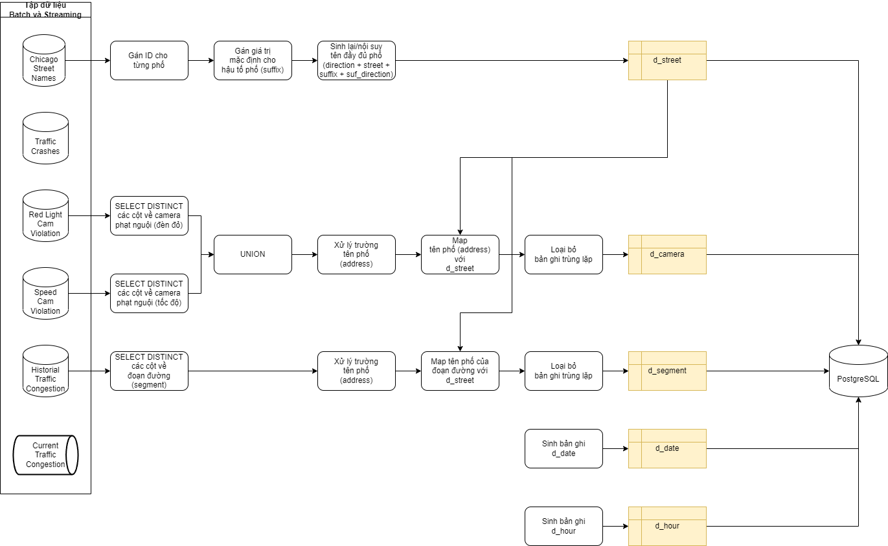
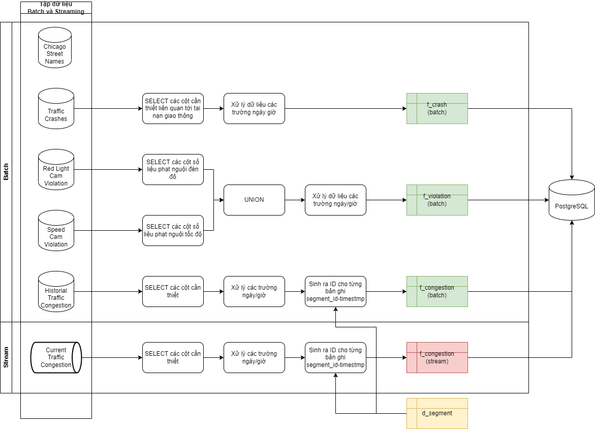

## `batch` -- Xử lý dữ liệu dạng lô bằng Apache Spark

[<-- Quay lại](../README.md)

Thư mục này chứa các hàm biến đổi dữ liệu dimension/fact bằng DataFrame hoặc SQL API của Apache Spark, 
hàm đọc ghi dữ liệu, lược đồ dữ liệu thô

| Đường dẫn thư mục/tệp mã nguồn    | Mô tả                                                                                                         |
|--------------------------------   |---------------------------------------------------------------------------------------------------------------|
| [dimensions.py](./dimensions.py)  | Các hàm sinh/biến đổi dữ liệu dạng lô các dimension d_street, d_camera, d_segment, d_date, d_hour             |
| [facts.py](./facts.py)            | Các hàm sinh/biến đổi dữ liệu dạng lô các fact f_violation, f_congestion, f_crash                             |
| [rw.py](./rw.py)                  | Các hàm utility đọc dữ liệu từ HDFS/local filesystem vào Spark, ghi dữ liệu từ Spark DataFrame vào PostgreSQL |
| [schemas.py](./schemas.py)        | Lược đồ dữ liệu của các bảng của tập dữ liệu thô                                                              |

Hình 1. Tổng quan các bước biến đổi dữ liệu dimension trong file [dimensions.py](./dimensions.py)

Hình 1. Tổng quan các bước biến đổi dữ liệu fact trong file [facts.py](./facts.py)