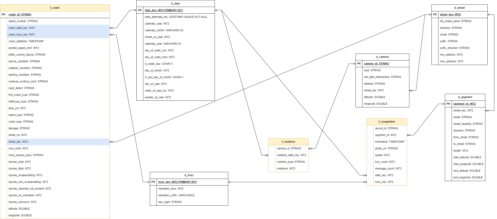

## `sql` -- Chứa các DDL, DML dùng trong môi trường Spark SQL hoặc PostgreSQL

File [ddl.sql](./ddl.sql) chứa các câu lệnh DDL dùng để định nghĩa các bảng dimension và fact trên môi trường PostgreSQL.

Các file `d_*.sql` và `f_*.sql` là các câu lệnh DML có thể được dùng với Spark SQL để biến đổi dữ liệu từ dạng thô sang dạng star schema sẵn sàng cho vào PostgreSQL.

Hình 1. Lược đồ ER cho Data Mart. Định nghĩa bởi file [ddl.sql](./ddl.sql)