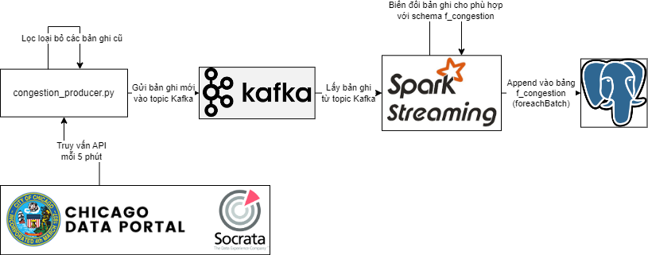

## `streams` -- Xử lý dữ liệu streaming bằng Apache Kafka và Apache Spark Structured Streaming API

[<-- Quay lại](../README.md)

Thư mục này chứa Kafka Producer cho Streaming API của các tập dữ liệu, các Job Spark Streaming đọc từ Kafka xử lý dữ liệu

| Đường dẫn thư mục/tệp mã nguồn | Mô tả                                                                                                                                                                                                                                                                                                                     |
|--------------------------------|-----------------------------------------------------------------------------------------------------------------------------------------------------------------------------------------------------------------------------------------------------------------------------------------------------------------------|
| [congestion_producer.py](./congestion_producer.py)         | Kafka Producer cho Socrata API của tập dữ liệu Current Traffic Congestion Estimates (cập nhật mỗi 15 phút, phản ảnh 10 phút gần nhất): Mỗi 5 phút truy vấn tới API một lần, kiểm tra kết quả API có bản ghi mới không, đẩy bản ghi mới vào Kafka Topic (tên Topic trong file .env)                                    |
| [congestion_consumer.py](./congestion_consumer.py)         | Một Spark Job sử dụng Structured Streaming API đọc dữ liệu từ Kafka Topic của tập dữ liệu Current Traffic Congestion Estimates, sau đó sử dụng API foreachBatch() để biến đổi mỗi bản ghi sao cho phù hợp với bảng f_congestion trong Data Mart và dùng API DataFrame để append các bản ghi mới vào bảng f_congestion |
| [submit_consumer_local.sh](./submit_consumer_local.sh)       | Sử dụng spark-submit.sh để submit job congestion_consumer.py để được lập lịch thực thi với các packages dùng với Kafka. Tham số master: local[*] == chạy trên máy local                                                                                                                                               |
| [submit_consumer.sh](./submit_consumer.sh)             | Sử dụng spark-submit.sh để submit job congestion_consumer.py để được lập lịch thưc thi với các packages dùng với Kafka. Sử dụng tham số mặc định ở `$SPARK_HOME/conf/spark-defaults.sh`                                                                                                                               |

Dưới đây là sơ đồ mô tả tóm tắt cách hoạt động của lớp streaming

